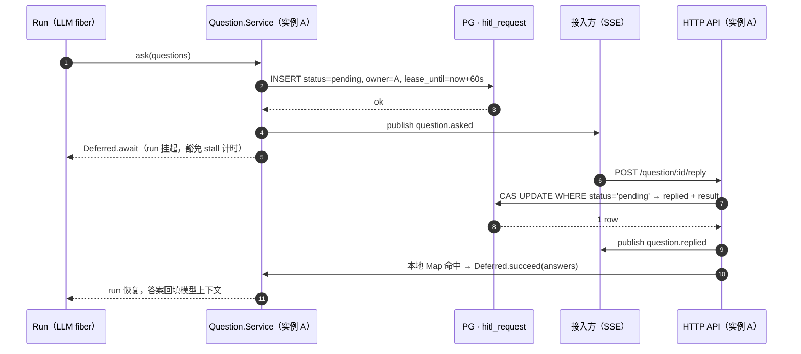
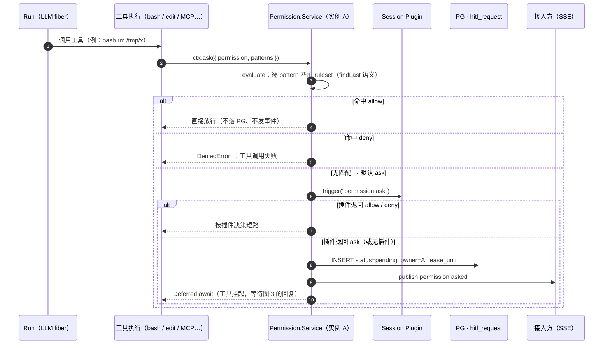
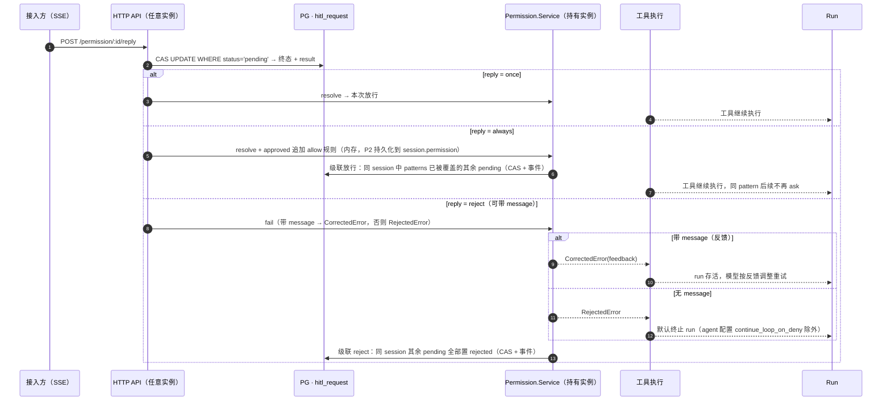
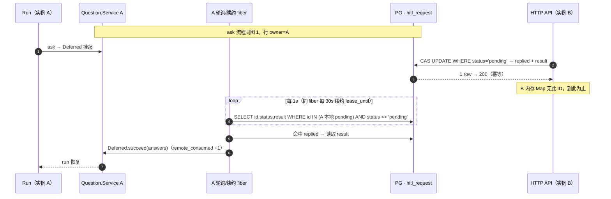
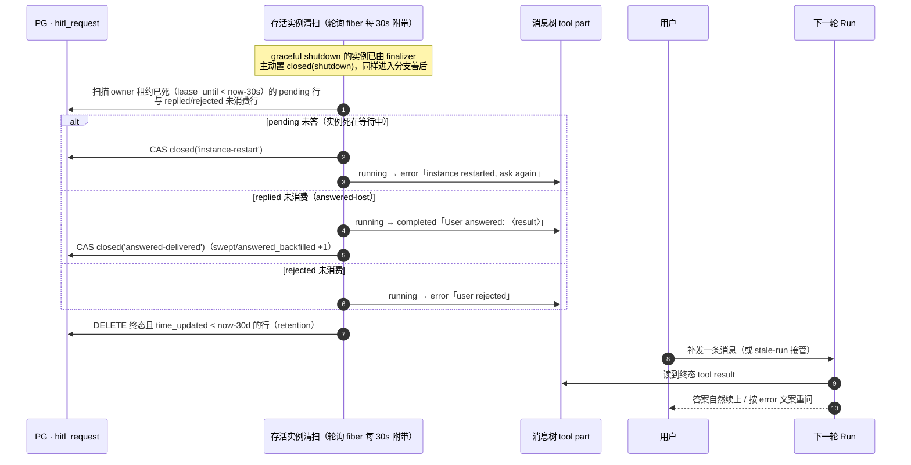

# HITL 挂起状态持久化设计（question / permission）

> 对应缺陷钉住用例：[`docs/test-cases/session/question-pending-persistence.md`](test-cases/session/question-pending-persistence.md)

## 1. 问题

`question.ask()` / `permission.ask()` 的 pending 状态仅存于实例内存（`InstanceState` 的 `Map<id, {info, deferred}>`），不落 PG：

| 触发场景 | 后果 |
|---|---|
| 多实例路由切换（K8s 多副本） | reply/reject 打到无状态的实例 → 404 |
| pod 重启 / 发版（graceful） | finalizer 把 pending 全部 fail 成 `RejectedError` =「用户拒绝」，run 终止 |
| pod 硬杀 | Deferred 无人管；`question` 不在 watchdog `MONITORED_TOOLS`（`watchdog-sql.ts:4`），悬空 tool part **无人善后、永久 running** |
| `always` 放行规则 | `approved` 数组在内存，重启即丢，重启后同 pattern 重新弹 ask |

架构根因：上游假设单机 TUI（进程 = 会话生命周期），SaaS 多实例 + K8s 漂移重启不成立。

## 2. 现状盘点（可复用的基础设施）

| 设施 | 位置 | 与本方案的关系 |
|---|---|---|
| watchdog orphan 检测 | `session/watchdog.ts` / `watchdog-sql.ts` | 已有「本地 ToolExecution 内存表 + part 行级 `metadata.watchdog.leaseUntil` 租约 + 超时/orphan 清扫」模式，本方案直接沿用该模式 |
| markTimedOut | `session/mark-timed-out.ts` | 已有把 running tool part 原子改写为 error 终态的能力（CAS on `expectedStart`），善后悬空 part 复用此写法 |
| ToolExecution | `session/tool-execution.ts` | 进程内 `Map<sessionID:callID, AbortController>`，判定「执行是否本实例持有」 |
| sync 事件溯源 | `sync/index.ts` + `event`/`event_sequence` 表 | durable 事件落 PG 的现成通道（P2 复用） |
| `session.permission` 列 | `session/session.pg.ts` | jsonb 规则数组，findLast 评估语义，机器可写（PATCH API 即在写），`always` 持久化的天然落点 |
| GlobalBus | `bus/global.ts` | **进程内 EventEmitter，不跨实例**——跨实例通知不可依赖它 |

关键约束：`question` / `bash` 不在 `MONITORED_TOOLS`（question 合法无限期等待、bash 合法长跑），因此**不能**通过把 question 加进监控列表来解决悬空善后——善后必须按「持有实例已死」判定，而非按时间超时判定。

## 3. 目标与非目标

**目标**

1. pending 状态落 PG，任意实例可见、可回复（跨实例 reply）
2. 实例死亡（重启/漂移/硬杀）后：pending 有明确终态（closed），悬空 tool part 有终态，UI 不悬空、不误报「用户拒绝」
3. reply/reject 幂等语义：重复提交、迟到提交返回当前状态而非裸 404
4. **用户已提交的答案不丢**：answered-lost 场景答案回填进消息树，下轮 LLM 可续

**非目标（P2/P3）**

- 不做 run 级自动恢复。与 Temporal/LangGraph（run 状态本身持久化、worker 重启自动续跑）的明确差异：opencode 的 run 活在内存 fiber 中，「补 part 终态 + 下轮续上」是消息树架构下的轻量等效——**用户需再发一条消息（或 stale-run 接管）才触发续跑**，不是自动续跑。验收时按此预期。
- 不做 steer 注入（非阻塞问答）——新特性，见 pi-ask 对比
- 不改 runner / stale-run 接管逻辑

## 4. 总体设计

### 4.1 新表 `hitl_request`（question 与 permission 统一）

两者生命周期同构（pending → replied/rejected/closed），统一一张表、一套恢复逻辑；`id` 前缀（`que_` / `prm_`）与 `kind` 列自带区分。

```sql
CREATE TABLE hitl_request (
  id            text PRIMARY KEY,      -- que_* / prm_*（沿用现有 ID 生成）
  kind          text NOT NULL,         -- 'question' | 'permission'（CHECK 约束）
  directory     text NOT NULL,         -- 实例目录隔离（对齐 session 表惯例）
  session_id    text NOT NULL REFERENCES session(id) ON DELETE CASCADE,
  owner_id      text NOT NULL,         -- 持有 Deferred 的实例 ID（每次启动生成 UUID）
  status        text NOT NULL,         -- 'pending' | 'replied' | 'rejected' | 'closed'（CHECK 约束）
  payload       jsonb NOT NULL,        -- QuestionV1.Request / PermissionV1.Request 全文（含 tool 定位）
  result        jsonb,                 -- answers / { reply, message?, causedBy? }
  close_reason  text,                  -- 'instance-restart' | 'shutdown' | 'answered-delivered' | 'decision-delivered'（CHECK 约束）
  lease_until   bigint NOT NULL,       -- 行级租约：持有实例每 30s 续约（以 PG clock_timestamp 为准）
  time_created  bigint NOT NULL,
  time_updated  bigint NOT NULL
);
CREATE INDEX idx_hitl_pending  ON hitl_request (directory, kind, status, lease_until);
CREATE INDEX idx_hitl_session  ON hitl_request (directory, session_id, status);
CREATE INDEX idx_hitl_retention ON hitl_request (status, time_updated);
```

硬化要点（相对初版）：`lease_until NOT NULL`（NULL pending 永不被 dead 查询命中）、`session_id` FK 级联删除（session 删后无孤儿）、kind/status/close_reason CHECK（非法状态进不了库）、复合索引对齐主要查询（清扫/级联/限流计数/retention 均索引前缀命中）。`directory` 参与所有 CAS 与读路径（跨目录 ID 不可操作）。

配套：`packages/opencode/src/hitl/request.pg.ts`（drizzle 定义）+ `migration-pg/<时间戳>_hitl_request/migration.sql`。

**为什么行级租约而不是实例心跳表**：清扫 SQL 一条完成（`status='pending' AND lease_until < now - grace`），少一张表；挂起请求数量级极小（人机交互），30s 续约 UPDATE 多行无压力。沿用 watchdog 在 part metadata 里写 `leaseUntil` 的既有模式。

**实例 ID**：启动时生成 UUID（进程生命周期内不变），finalizer 里主动清理。

### 4.2 状态机

```
                 reply(CAS)                reject(CAS)
   pending ─────────────────→ replied    ─────────────────→ rejected
      │                          │ answer 已回填 part
      │  清扫：owner 租约过期     └────────────────→ closed('answered-delivered')
      └────────────────────────→ closed('instance-restart' | 'shutdown')
```

`replied` / `rejected` / `closed` 均为终态；所有迁移用 `WHERE id = ? AND status = 'pending'`（replied → closed 用 `AND status = 'replied'`）原子 CAS，天然幂等。

### 4.3 写路径

**`ask()`（question/permission service，持有实例）**：

1. `INSERT INTO hitl_request (status='pending', owner_id=me, lease_until=now+60s)` — 失败则 fail fast 不挂起（PG 不可用时宁可工具报错，不产生不可见 pending）
2. 内存 `Map` 照旧存 `{info, deferred}`（本实例消费索引 + `list()` 缓存）
3. `events.publish(Asked)`（SSE 照旧）
4. `Deferred.await` + `ensuring`：只清内存。**中断/取消不写终态**（旧行为把取消写成 closed(answered-delivered) 会伪造已交付并逃逸清扫）；PG 行保持 pending，由租约断链走统一清扫路径

**`reply()` / `reject()`（任意实例）**：

1. CAS：`UPDATE ... SET status='replied', result=..., time_updated=now WHERE id=? AND kind=? AND directory=? AND status='pending' RETURNING *`（directory 绑定防跨目录 IDOR）
   - 返回 1 行 → 成功（权威结果 = PG result）；publish 事件；本实例有 Deferred 按 **PG result**（非 HTTP 输入）resolve
   - 返回 0 行 → 读当前行（同样绑定 kind+directory）：
      - 终态且 status/result/close_reason 与本次提交完全相同 → **幂等 200**
      - 终态但决策不同 → **409 Conflict**（绝不按迟到提交的内容消费本地 Deferred）
      - 行不存在 → 404（唯一保留 404 的场景）
2. 本实例内存有该 ID → 按 PG 权威结果 resolve/fail；没有（跨实例）→ 到此为止，持有实例轮询发现

**`list()`**：改为查 PG（`status='pending' AND directory=me`）——`GET /question`、`GET /permission` 立即跨实例可见。

**时序图 1：ask → reply 正常链路（同实例，以 question 为例）**



**permission 审批特有链路**：与 question 不同，permission 的 `ask()` 在进入通用挂起路径（图 1 第 2–5 步）之前有两级前置短路——ruleset 评估与 session plugin 决策；reply 为三态且带级联语义（`permission/index.ts` 现有行为，P1 全部保留，仅状态落 PG）。

**时序图 2：审批决策链（两级短路 → 挂起）**



**时序图 3：审批三态回复（once / always / reject + 级联）**



### 4.4 跨实例消费：持有实例轮询

Question / Permission service 在**每个 directory 的 `InstanceState.make` 初始化闭包内**各起一个 scoped fiber（fiber 闭包捕获该实例的 state 与 ctx.directory，随 ScopedCache 条目销毁中断）：

- 每 **1s**：`SELECT ... WHERE id IN (本地 pending IDs) AND owner_id=me AND directory=me AND status <> 'pending'`
- 发现状态变化 → 按 **PG result** resolve（replied → `Deferred.succeed`，question 取 `result.answers`、permission 取 `result.reply` 且 `reject+message` 重建 `CorrectedError`；rejected → fail）
- 同一 fiber 顺带做**租约续约**：每 30s `UPDATE ... SET lease_until=clock_timestamp()+60s WHERE id IN (本地) AND owner_id=me AND status='pending'`
- 每 30s 附带执行一次 §4.5 清扫（同 directory）
- 单次迭代内捕获非中断错误（log 后下一轮继续）；`Effect.repeat` 只在成功后继续，错误必须在 iteration 内恢复而不是在 repeat 外 catch
- **所有时间戳取 PG `clock_timestamp()`**（`lease_until`、`time_updated`、清扫判定），消除 Pod 本地时钟漂移导致的误清/漏清

**为什么轮询而不是 PG LISTEN/NOTIFY**：人机交互场景 1s 延迟无感；无连接/通道管理复杂度；与 watchdog 轮询风格一致；PG bridge 层无需新增能力。

**时序图 4：跨实例 reply（多副本路由）**



### 4.5 实例死亡善后（清扫）

任意实例的轮询 fiber 每 30s 附带执行（同一事务）：

1. **清死实例的 pending**：
   ```sql
   UPDATE hitl_request SET status='closed', close_reason='instance-restart', time_updated=clock_timestamp()
   WHERE status='pending' AND directory=me AND lease_until < clock_timestamp() - 30s
   RETURNING *
   ```
   graceful shutdown **不单独处理**（实现从简）：finalizer 只 fail 内存 Deferred（现状行为），PG 行保持 pending、租约自然断，与硬杀统一走同一条清扫路径——单一代码路径换取最多 ~120s 的额外检测延迟。
2. **善后悬空 tool part（三分支，核心是答案不丢）**：对每个刚终态化且 `payload.tool` 存在的行（question 必有；permission 的 `Request.tool` 亦携带 messageID/callID），按行的终态把对应 running tool part 改写为：
   - `replied` 未消费（answered-lost）→ **completed 终态，output = 用户答案回填**（question：`"User answered: 继续"`；permission：`"User approved (once)"`）。下一次任何 prompt 触发新 run 时，LLM 读消息树看到完整 tool call/result 对，**答案自然续上**——等效 pi-ask 的持久化恢复，无需重建 run
   - `closed`（pending 未答）→ error 终态：`Question closed: the opencode instance restarted before the user answered. Ask again if still needed.`
   - `rejected` 未消费 → error 终态：`The user rejected this request.`

   **claim-first 事务**：每行的善后在**单个 PG 事务**内完成——先 CAS 请求行到终态（阻断并发 reply），再在同事务内 CAS 更新 running part（`WHERE data->'state'->>'status'='running' AND start 匹配`，run 正常写完则不命中）；part 定位失败或 CAS 失败则整个事务回滚，行保持原状等待下轮重试（**绝不把未回填答案的行标记为已交付**）。`PartUpdated` 事件在事务提交后发布，避免读到未提交状态。
3. **answered-lost 检测**：`status='replied' AND owner 租约已死` 的行同样进入善后（answer 已落 `result`，只差 part 回填），回填后置 `closed(close_reason='answered-delivered')` 归档语义；`rejected` 未消费行善后后置 `closed(close_reason='decision-delivered')`。

**多实例安全**：行级租约保证不清活实例的行；清扫动作本身是 CAS + 事务，两实例并发清扫无竞争伤害（后到者 claim 不命中，安全跳过）。

**时序图 5：实例死亡清扫（三分支善后 + retention）**



### 4.6 `always` 规则持久化（P2）

reply = `always` 成功时，将 `{permission, pattern, action:'allow'}` 规则 merge 进 `session.permission` 列（现有 PATCH 合并语义 + findLast 评估，追加即生效）：

- 重启 / reload / 任意实例评估时天然生效（评估读的是 session 行的 ruleset，非内存）
- 对用户透明：`GET /session` 可见规则，PATCH 可删
- 内存 `approved` 数组保留（省一次 DB 读），语义降级为缓存

### 4.7 事件 durable 化（P2，可选）

`question.asked/replied/rejected`、`permission.asked/replied` 加 `durable` 标注（v1）走 sync 落 `event` 表：

- SSE 断线重连可按 seq 追赶，不丢 `asked`
- 审计有据（「问过什么、答了什么」可查）
- 触碰 core event 聚合设计（aggregate = session），独立小 PR 评估

### 4.8 数据保留与背压上限

- **retention**：`hitl_request` 是状态表（非事件日志，event 表另论），终态行由轮询 fiber 顺带清理：`status <> 'pending' AND directory=me AND time_updated < clock_timestamp() - 30d` 删除。挂起中的行永不清理。
- **pending 上限**：单 session 挂起请求数上限（`OPENCODE_HITL_MAX_PENDING_PER_SESSION`，默认 10），question 与 permission 各自计数、共用同一 flag。PG 模式下在 session 级 advisory lock 事务内**原子「计数 + INSERT」**（多实例/并发 ask 不可突破）；SQLite 模式退化为内存计数（单进程视图）。超限的 `ask()` 不挂起，直接以明确错误返回（防失控 agent 无限 ask 打爆表与 UI）。

### 4.9 可观测性

对齐 watchdog 的 span attribute 风格（`watchdog.scanned/stuck/marked`）：

- 清扫：`hitl.swept_pending`（closed 数）、`hitl.answered_backfilled`（答案回填数）、`hitl.duration_ms`
- 轮询消费：`hitl.remote_consumed`（他实例 reply 被本实例消费数，多实例路由生效的直接证据）
- 租约续约失败 / 清扫 SQL 失败：`log.error` + 计数，连续失败不致命（下轮重试）

### 4.10 HTTP 语义变化（对接入方）

| 场景 | 现行为 | 新行为 |
|---|---|---|
| reply 挂起中的请求 | 200 | 200（不变） |
| reply 已 replied 且决策相同（重复点） | — | 200（幂等，布尔语义不变） |
| reply 已 closed/rejected 或决策不同（迟到/冲突提交） | 404 | **409 Conflict**（message 注明当前状态与原因） |
| reply 不存在的 ID | 404 | 404（不变） |
| `GET /question` / `GET /permission` | 仅本实例 pending | 全实例 pending（directory 内）；PG 故障时 5xx（不伪装为空列表） |

成功仍返回布尔 `true`（SDK 兼容）；冲突是明确的新错误通道（`ConflictError`），不与成功复用同一响应体。

### 4.11 权威结果与级联（permission）

- reply 落 PG 后**以 PG result 为准**消费本地 Deferred（含跨实例轮询路径），reject 的 `message` 持久化在 `result.message`，持有实例据此重建 `CorrectedError(feedback)`
- `always`：单事务内完成目标行 CAS → `session.permission` 规则合并写入 → 同 session 其余 pending 依新规则级联 CAS 放行（`result.causedBy` 记录来源）→ 提交后统一 publish；持有实例轮询发现 always 级联行后同步追加内存 approved 规则
- `reject`：目标行带 `result.message` 落库后，同 session 其余 pending 级联 CAS reject（不带 message，与 V1 语义一致）
- session 级 advisory lock（`pg_advisory_xact_lock(hashtext('hitl:<directory>:<sessionID>'))`）序列化同 session 的 reply 级联与 ask 限流插入，防并发 ask 漏过级联判定

## 5. 关键决策记录

| # | 决策 | 理由 | 替代方案（否决原因） |
|---|---|---|---|
| D1 | question/permission 统一 `hitl_request` 表 | 生命周期同构，一套恢复逻辑；ID 前缀天然区分 | 两张独立表（恢复/清扫代码重复）；走 sync 事件溯源（重量级，聚合设计成本高） |
| D2 | 跨实例通知用 1s 轮询 | 人机交互无感延迟；零新增依赖；与 watchdog 风格一致 | PG LISTEN/NOTIFY（连接与通道管理复杂）；GlobalBus（进程内，不跨实例） |
| D3 | 行级租约（30s 续约 + 30s grace） | 清扫一条 SQL；沿用 watchdog leaseUntil 既有模式 | 实例心跳表（多一张表）；pg_stat_activity 探活（依赖超级用户视图） |
| D4 | 悬空善后按「owner 死亡」判定，不按时间超时 | question 合法无限期等待，按时间杀会复发 stall 误杀事故（见 llm-stall-recovery） | 加入 MONITORED_TOOLS（否决，同上） |
| D5 | 死亡实例的 pending 一律 `closed`，不做 run 级恢复；**已答未消费的答案回填进消息树** | run 恢复依赖消息树重放 + 悬空 part 上下文重建，复杂度高；而答案回填 part 后下一轮 prompt 天然续上（消息树架构的轻量等效），用户已提交的答案不丢 | 接手实例重建 run 回填答案并自动续跑（列为 P3；与 Temporal 式自动恢复的差距已在非目标明示） |
| D6 | `always` 写 `session.permission` 列 | 列本来就是规则评估源、机器可写、UI 透明 | 新建 approved 规则表（多一张表且 GET /session 不可见）；只落 hitl_request.result 重建（历史累积无界） |
| D7 | `hitl_request` 定位为 **projection（状态投影）**，非事件溯源本体 | P1 直写状态表最小化触碰 core event 体系 | 直接走事件溯源一步到位（触碰 durable manifest 聚合设计，P1 周期内风险过高）。**修正（2026-09-14）**：原「P2 经 sync projector 维护同一张表」的收敛路径**对 SaaS 不成立**——`server.ts → init-projectors → server/projectors.ts` 是空实现（`initProjectors() {}`），`SyncEvent.init` 全库无调用点，projector 体系（`src/sync/` + `session/projectors.ts`）是上游「本地多设备同步」机制的死代码路径；SaaS 里连 `session` 表都是服务直写（`session.ts` 直插直查 `SessionTable`），HITL 的「状态表直写 + 事件桥」与全库同构，非债。P2 范围相应收窄为仅「事件 durable 化」 |

## 6. 分期

| 期 | 内容 | 验收 |
|---|---|---|
| **P1（止血，本周期）** | `hitl_request` 表 + migration；question/permission service 双写 PG + CAS reply + 轮询消费 + 租约；启动/周期清扫 + 悬空 part 三分支善后（含答案回填）；HTTP 幂等语义；pending 上限 + 终态 retention；可观测性 | 用例文档 T2.1–T2.4、T3.2、T4.1 全部转 PASS（按「修复后验收标准」列）；answered-lost 场景新用例：重启后补发消息，LLM 能引用已提交答案 |
| **P2（已收窄，2026-09-14）** | ~~`hitl_request` 转由 projector 维护~~（对 SaaS 不成立，见 D7 修正）；保留：`always` → session.permission（**P1 已提前完成**，事务内合并写入 + 重启恢复，见 T3.2 复测）；`question.asked/replied/rejected`、`permission.asked/replied` 标 **durable** 落 event 表（core EventV2 能力，不经过 SyncEvent/projector——收益：审计留痕 + SSE 断线 catch-up，即 `durable(aggregateID, after)` 重放补发）；bash-ask 悬空 part 覆盖确认 | 新增：event 表可查到 HITL 事件历史；SSE 断线重连后 pending 状态变化可补发 |
| **P3（对齐 pi-ask）** | 自动续跑（answered-lost 后无需用户再发消息）；steer 非阻塞注入 | 新特性独立用例 |

## 7. 涉及文件

**新增**

- `packages/opencode/src/hitl/request.pg.ts` — drizzle 表定义
- `packages/opencode/migration-pg/<时间戳>_hitl_request/migration.sql`

**修改**

- `packages/opencode/src/question/index.ts` — ask 双写 / reply CAS / 轮询+续约 fiber / finalizer 主动 closed
- `packages/opencode/src/permission/index.ts` — 同上（P1 不动 approved 持久化）
- `packages/opencode/src/server/routes/instance/httpapi/handlers/question.ts`、`handlers/permission.ts` — 幂等语义、list 读 PG
- `packages/opencode/src/session/mark-timed-out.ts` — 抽出通用 part 善后函数（或新增并列函数），支持 completed（答案回填）/ error 两种终态与自定义文案
- `packages/opencode/src/flag/flag.ts` — 新增 `OPENCODE_HITL_MAX_PENDING_PER_SESSION`（默认 10）

**不改**：runner.ts、processor.ts、watchdog.ts（MONITORED_TOOLS）、schema 事件定义（P1）

## 8. 测试计划

- 集成：`docs/test-cases/session/question-pending-persistence.md`（已写好 T1 基线 / T2 重启 / T3 permission / T4 多实例，修复后按「修复后验收标准」列回填复测记录）
- 单测（`packages/opencode` 目录内 `bun test`）：
  - CAS 幂等：重复 reply、迟到 reply、并发 reply
  - 清扫：租约过期 closed、graceful shutdown closed、answered-lost
  - part 善后：running → error 终态、文案、CAS 不覆盖已完成 part
- 多实例：组合 3（本地 PG）双容器按 T4.1 验证跨实例 reply

## 9. 风险与兼容

| 风险 | 缓解 |
|---|---|
| 上游 merge 冲突面扩大（question/permission 是上游文件） | 改动集中在 service 内部，方法签名与 HTTP 契约不变；合并前按 `docs/upstream-merge-guide.md` 评估 |
| PG 故障时 question/permission 不可用 | fail fast（INSERT 失败工具直接报错），不产生不可见 pending；与现有 PG 依赖面一致，无新增可用性要求 |
| 轮询 fiber 泄漏 | 随 InstanceState scope forkScoped，实例销毁自动中断（现有 finalizer 模式） |
| 旧实例（无 PG 写入）与新实例混跑 | 混跑期旧实例的 pending 仍为旧行为（无表记录），清扫仅作用于表内行——降级为现状，无恶化 |
| `OPENCODE_PG_STATEMENT_TIMEOUT_MS`（30s） | 心跳/轮询/清扫均为毫秒级单语句，无影响 |
